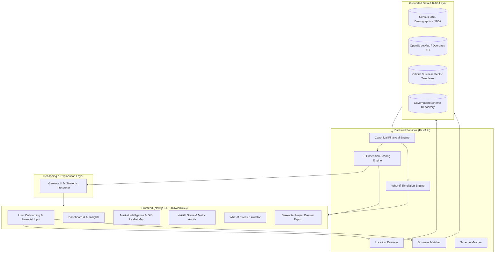

# 🌟 YuktiFi (युक्ति-Fi)
### *Audit-Grade Market Intelligence & Deterministic Financial Decision Engine for Micro-Entrepreneurs*

[](https://nextjs.org/)
[](https://fastapi.tiangolo.com/)
[](https://www.python.org/)
[](https://www.typescriptlang.org/)
[](https://tailwindcss.com/)
[](LICENSE)

---

## 📌 Overview

**YuktiFi** is an enterprise-grade, data-grounded AI decision and financial intelligence platform created for first-generation micro-entrepreneurs in India. Built with strict mathematical determinism, YuktiFi combines **Census of India 2011 demographics**, **OpenStreetMap / Overpass GIS spatial mapping**, and **bank-grade financial models** to assess enterprise viability, estimate revenue, test stress resilience, and generate bankable project appraisal reports.

### 🏛️ Core Architectural Principle
> **"Database Calculates → Evidence Records Provenance → RAG Ingests Official Datasets → LLM Interprets & Explains."**  
> *The AI model is never allowed to hallucinate financial numbers, population figures, competitor counts, EMI schedules, or government subsidy percentages.*

---

## 🚀 Key Features

### 1. 📊 Audit-Grade 5-Dimension Decision Model (YuktiFi Score)
Evaluates business viability on a scale of `0–100` across 5 distinct dimensions:
* **Financial Viability**: Profitability, operating cash flow, net margin, and margin of safety.
* **Repayment Capacity**: Multi-tiered Debt Service Coverage Ratio (DSCR) & EMI affordability.
* **Market Opportunity**: Catchment demand sizing via Census 2011 PCA population and household ratios.
* **Capital Efficiency**: Return on Investment (ROI), Return on Capital Employed (ROCE), and payback period.
* **Risk Exposure (Resilience)**: Composite risk modeling combining financial, operational, market, and data uncertainties (`Resilience Score = 100 − Risk Index`).

### 2. 🗺️ Market Intelligence & GIS Spatial Mapping
* Interactive **Leaflet GIS Map** with CARTO Voyager tiles.
* Dynamic **5 km trade catchment radius** with opportunity expansion zones.
* Live competitor density survey using the **OpenStreetMap / Overpass API**.
* Demographic customer personas, SWOT breakdown, and addressable revenue headroom.

### 3. 🧪 Real-Time What-If & Stress Testing Simulator
* Live interactive parameter testing: **Demand Shocks (±50%)**, **Cost Inflation (+50%)**, and **Pricing Realization (±30%)**.
* Live baseline vs. simulated comparison for **ROI (%)** and **DSCR ($x$)** with directional trend indicators.
* Instant feedback on cash-flow survival under downside stress.

### 4. 🏛️ Government Schemes & Credit Subsidy Matcher
Automated routing and terms guidance for flagship central & state schemes:
* **PMEGP**: 15%–35% Capital Margin Money Subsidy with loan caps up to ₹50 Lakhs.
* **PM MUDRA Yojana**: Shishu (up to ₹50k), Kishore (up to ₹5L), and Tarun (up to ₹10L) collateral-free credit.
* **PMFME**: 35% credit-linked capital subsidy for micro food processing units.
* **Stand-Up India**: Composite financing for SC/ST and Women greenfield entrepreneurs.

### 5. 🌐 Bilingual Support (English & हिन्दी)
* Complete localization with seamless one-click toggle between English and Devanagari Hindi.

### 6. 📄 Bankable Project Report & Dossier Generation
* Export complete, ready-to-submit bank appraisal reports formatted with financial P&L schedules, balance sheets, and spatial market surveys.

---

## 🏗️ System Architecture



---

## 💻 Tech Stack

| Layer | Technologies |
| :--- | :--- |
| **Frontend** | Next.js 14 (App Router), React 18, TypeScript, Tailwind CSS, Lucide Icons, Framer Motion, Zustand, `next-intl` |
| **Mapping & Visuals**| Leaflet, React-Leaflet, CARTO Voyager Tiles, Recharts |
| **Backend** | FastAPI, Python 3.11 / 3.13, Pydantic v2, SQLAlchemy 2.0, Uvicorn, Jinja2, PyPDF |
| **External APIs & RAG**| Census of India 2011 PCA Dataset, OpenStreetMap Overpass API, Agmarknet, LGD Master |
| **AI / Narrative** | Google Gemini API / Anthropic Claude (Constrained Strategic Summarization) |
| **Testing** | Pytest, TypeScript Compiler (`tsc`), Next.js Production Build |

---

## 📂 Project Structure

```
.
├── backend/
│   ├── app/
│   │   ├── ai/                      # Gemini/LLM clients and prompt templates
│   │   ├── api/                     # REST API routers (analysis, simulator, schemes, etc.)
│   │   ├── api_clients/             # Overpass, Census, Agmarknet API connectors
│   │   ├── core/                    # App configuration, security, DB settings
│   │   ├── data_layer/              # Data retrieval & feature engineering
│   │   ├── engines/                 # Pure mathematical engines (Financial, Scoring, Simulation)
│   │   ├── location/                # National location & coordinate resolvers
│   │   ├── models/                  # SQLAlchemy ORM database models
│   │   ├── schemas/                 # Pydantic v2 data validation contracts
│   │   └── templates/               # Sector business templates & Jinja report templates
│   ├── data/                        # Curated demographic datasets & location masters
│   ├── tests/                       # Comprehensive pytest suite (truth tests, simulation, math)
│   ├── pyproject.toml               # Python dependencies and pytest configuration
│   └── requirements.txt             # Pip dependencies
│
├── frontend/
│   ├── app/
│   │   └── [locale]/                # Next.js 14 App Router localized pages
│   │       ├── dashboard/           # Main executive dashboard & strategic directives
│   │       ├── market-intelligence/ # 7-tab market intelligence suite & GIS map
│   │       ├── score/[categoryId]/  # 5-dimension YuktiFi Score & audit breakdowns
│   │       ├── simulator/           # What-If interactive stress testing sandbox
│   │       ├── report/              # Bankable project dossier generator
│   │       └── ...
│   ├── components/                  # Reusable UI widgets, Leaflet Map, ScoreDial, Modals
│   ├── lib/                         # Zustand global state store & API client
│   ├── messages/                    # English & Hindi i18n translation dictionaries
│   └── package.json                 # Frontend dependencies and scripts
│
├── WORKABLE_SYSTEM.md               # Quick operational runbook
└── README.md                        # Primary project documentation
```

---

## ⚡ Quick Start Guide

### Prerequisites
* **Node.js**: v18+ & npm
* **Python**: v3.11+ (or v3.13)
* **Git**

---

### 1. Backend Setup

```bash
# Navigate to the backend directory
cd backend

# Create and activate Python virtual environment
python -m venv .venv
# On Windows:
.venv\Scripts\activate
# On Linux/macOS:
# source .venv/bin/activate

# Install dependencies
pip install -r requirements.txt

# Create .env configuration
cp .env.example .env   # Or configure settings as needed

# Run FastAPI backend server
uvicorn app.main:app --reload --host 127.0.0.1 --port 8000
```
> 📖 Interactive Swagger API Documentation will be live at: **`http://127.0.0.1:8000/docs`**

---

### 2. Frontend Setup

```bash
# In a new terminal, navigate to the frontend directory
cd frontend

# Install Node dependencies
npm install

# Start Next.js development server
npm run dev
```
> 🌐 The YuktiFi Web Application will be live at: **`http://localhost:3000`**

---

## 🧪 Running Tests & Verification

YuktiFi includes a comprehensive test suite to guarantee 100% mathematical accuracy and prevent data hallucination.

### Backend Test Suite (Pytest)
```bash
cd backend
python -m pytest tests/
```
* **Coverage**: Financial calculation truth tests, capital sizing, What-If simulation engine, Census demographic pipeline, scheme eligibility routing.

### Frontend Typecheck & Build
```bash
cd frontend
# TypeScript validation
npm run typecheck

# Production build compilation
npm run build
```

---

## 🔒 Security & Provenance Governance

1. **No Data Fabrication**: If a location or category lacks sufficient demographic or unit economics data, the system outputs explicit `INSUFFICIENT_DATA` statements instead of guessing or inserting deceptive constants.
2. **Deterministic Precedence**: All financial decisions, interest amortizations, DSCR thresholds, and scores are evaluated directly by deterministic Python modules before the LLM generates explanatory summaries.
3. **API Integrity**: Non-public endpoints are guarded with API keys and CORS domain allowlists.

---

## 👥 Authors & Acknowledgments

* **Team YuktiFi** — Built for the **Smart India Hackathon (SIH)**.
* Dedicated to empowering micro-entrepreneurs, self-help groups (SHGs), and rural innovators with institutional-grade financial decision support.

---

## 📄 License

This project is licensed under the **MIT License** — see the [LICENSE](LICENSE) file for details.
