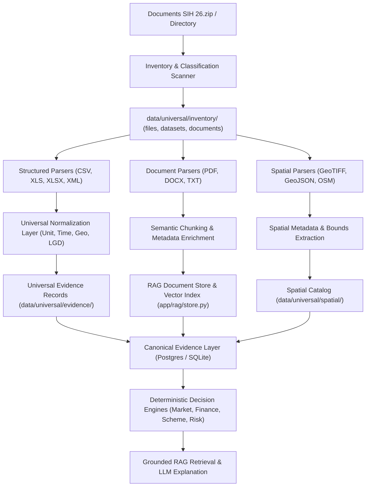

# YUKTIFI — Universal Data & Evidence Architecture Audit
**Document Version**: 1.0.0  
**Audit Date**: September 30, 2026  
**Problem Statement**: SIH 2026 PS 26091 — *"AI-Driven Hyper-Local Business Advisory and Financial Structuring Assistant for Rural Micro-Entrepreneurs"*  
**Source Collection**: `Documents SIH 26` (`D:\Ai workshop\Documents SIH 26`)

---

## 1. Executive Summary

YUKTIFI's core architectural principle is:
```
DATABASE CALCULATES → RAG RETRIEVES → DETERMINISTIC ENGINES DECIDE → LLM EXPLAINS
```

This audit establishes the baseline of the existing codebase and outlines the concrete plan to unify the heterogeneous datasets in `Documents SIH 26` (Census 2011, Local Government Directory master tables, MoSPI HCES 2022-23/2023-24, WorldPop 2025 GeoTIFFs, NFHS-5, Agricultural/Irrigation statistics, and ISRO Bhuvan geospatial specifications) into a **Universal Yukti Data & Evidence Layer**.

---

## 2. Existing System Architecture Audit

### 2.1 Existing Data Architecture
- **Location & Demographics**: `app.providers.census_provider`, `app.providers.worldpop_provider`, `app.location.service`, and `app.providers.taxonomy`.
- **Market & Competitors**: `app.providers.osm_provider` (Overpass API for spatial competitor discovery), `app.providers.overture_provider`, `app.data_layer.providers.agmarknet_provider`, and `app.data_layer.providers.consumer_affairs_provider`.
- **Consumption & Expenditure**: `app.data_layer.providers.hces_provider` and `app.data_layer.normalization.hces_normalizer`.
- **Business Templates**: `app.templates.business_templates` defines 20+ micro-enterprise templates (Kirana, Dairy, Flour Mill, Solar Pumps, Poultry, etc.) with verified cost baselines and unit economics.

### 2.2 Existing Evidence Architecture
- **Canonical Schema**: [`app.evidence.schema`](file:///d:/Nandini/Agents/SIH/work/backend/app/evidence/schema.py) implements `EvidenceRecord`, `EvidenceState` (`VERIFIED`, `ESTIMATED`, `INFERRED`, `STALE`, `CONFLICTING`, `MISSING`, `UNAVAILABLE`), `Confidence` (`HIGH`, `MEDIUM`, `LOW`, `UNAVAILABLE`), and provenance lineage tracking (`transform()`, `require()`).
- **Phase 2 In-Memory Store**: `app.phase2.service` holds ingested evidence in-process. It will be extended to back against the persistent database tables (`dataset_catalog`, `evidence_records`, `geography_catalog`).

### 2.3 Existing RAG Architecture
- **Document & Chunk Store**: [`app.rag.store`](file:///d:/Nandini/Agents/SIH/work/backend/app/rag/store.py) manages SQLite/Postgres tables `yukti_rag_documents` and `yukti_rag_chunks` with BM25/lexical and title-boost scoring.
- **RAG Service & Grounding**: `app.rag.service` routes queries through grounded document search, enforcing strict citation bounds so LLM responses never fabricate numbers.
- **Corpus Ingestion**: `app.rag.ingest` and `app.rag.seed_corpus` parse PDFs, DOCX, and text guidelines into indexed chunks.

### 2.4 Existing Database Models
- [`app.core.db`](file:///d:/Nandini/Agents/SIH/work/backend/app/core/db.py) defines SQLAlchemy `Base` and migration hooks.
- Existing models: `User`, `Location`, `BusinessCategory`, `Session`, `Competitor`, `MarketMetric`, `CostModel`, `GovernmentScheme`, `SchemeRule`, `LoanProduct`, `FinancialProjection`, `Scenario`, `Recommendation`, `ConfidenceTag`, `Source`, `Price`, `ProjectFinancialAssumptions`, `FinancialAssumptionsAudit`, `HCESConsumption`, `AgmarknetPrice`, `ConsumerAffairsPrice`.

### 2.5 Canonical Financial Calculation Engine
- [`app.engines.financial_engine`](file:///d:/Nandini/Agents/SIH/work/backend/app/engines/financial_engine.py) is the **single source of truth** for:
  - Capital sizing (Plant & Machinery, Civil Works, Working Capital margin)
  - Loan amortization and monthly EMI calculations
  - Profit & Loss statements, Depreciation (Straight-Line Schedule), Net Margin
  - Debt Service Coverage Ratio (DSCR), Return on Investment (ROI), Break-Even Analysis
- **Constraint**: The financial engine formulas will NOT be modified or duplicated. The Universal Data Layer directly feeds normalized cost baselines and parameters into this canonical engine.

---

## 3. Discovered Duplicates & Legacy Modules

| Component / Area | Legacy / Duplicate | Canonical Target | Action |
| :--- | :--- | :--- | :--- |
| **Evidence Store** | In-process dict `_RECORDS` in `app.phase2.service` | `app.evidence.universal_store` backed by SQLite/PostgreSQL | Extend Phase 2 service to write-through to SQL |
| **RAG Store** | Independent seed files | Unified `app.rag.store` with semantic + lexical hybrid indexing | Extend `app.rag.store` and plug into Universal Document Pipeline |
| **Commodity Mappings** | Hardcoded dictionaries in multiple providers | `app.data_layer.normalization.commodity_mapper` | Centralize under universal normalization layer |
| **Location Aliasing** | Static Solapur fallbacks | `app.providers.geography_normalizer` + LGD Master tables | Universal multi-tier geography catalog (State → District → Sub-District → Village/Town) |

---

## 4. Integration Points & Planned Files

### 4.1 New Modules to Create
1. **`data_pipeline/`**
   - `build_universal_dataset.py`: Master repeatable CLI pipeline.
   - `inventory_scanner.py`: Recursive SHA-256 metadata inventory scanner for `Documents SIH 26`.
   - `parsers/`: Modular parsers for CSV, XLS (Census DCHB, LGD, NFHS), XLSX, XML (Irrigation), PDF (DCHB, HCES, Bhuvan), GeoTIFF (WorldPop metadata).
   - `normalizers/`: Unit, time, geography, and commodity normalizers.
   - `validators/`: Data quality, quarantine, and duplicate detection engine.
2. **`backend/app/data_layer/universal/`**
   - `evidence_contract.py`: Canonical Universal Yukti Evidence Contract (Pydantic & dataclass).
   - `dataset_catalog.py`: Official metadata registry of all discovered datasets.
   - `geography_catalog.py`: LGD & Census administrative hierarchical catalog.
   - `business_mapping.py`: Business Category → Relevant Datasets & Indicators mapping engine.
   - `retrieval_service.py`: Unified multi-factor evidence retrieval (`retrieve_evidence`, `retrieve_documents`).
3. **`backend/app/api/`**
   - `routes_universal_evidence.py`: Unified endpoints (`/api/evidence/...`, `/api/data/catalog`, `/api/data/quality`).
4. **`data/universal/`**
   - `manifest.json`: End-to-end pipeline manifest and dataset hash audit.
   - `inventory/`: `files.json`, `datasets.json`, `documents.json`.
   - `mappings/`: `business_dataset_mapping.json`, `business_taxonomy.json`.
   - `validation/`: `validation_report.json`.
   - `catalog/`, `normalized/`, `evidence/`, `geography/`, `spatial/`, `documents/`.

### 4.2 Existing Files to Integrate & Extend
- `backend/app/main.py`: Register universal evidence and catalog routes.
- `backend/app/rag/store.py` & `backend/app/rag/service.py`: Add hybrid semantic/lexical filtering and document chunk tracking.
- `backend/app/phase2/service.py`: Connect to the universal evidence layer.
- `backend/app/core/db.py`: Register new SQL tables for dataset catalog, geography catalog, evidence records, and quality reports.
- `backend/app/engines/market_intelligence/`: Ingest universal demographic, expenditure, and agricultural price evidence.

---

## 5. Migration & Execution Strategy



This ensures complete traceability, zero LLM numeric fabrication, and preservation of raw source fidelity.
